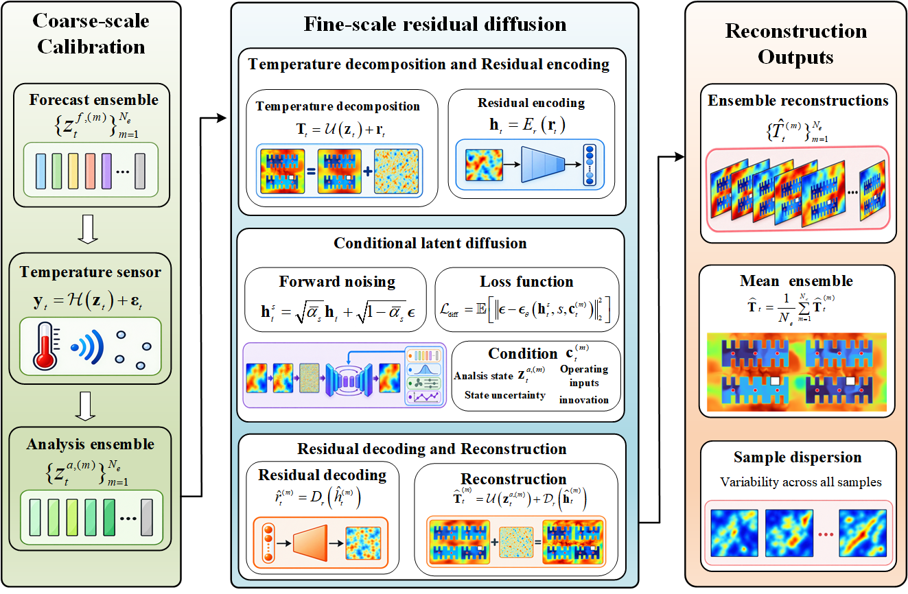
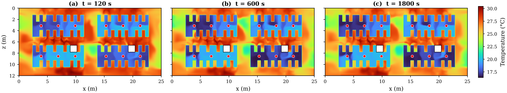
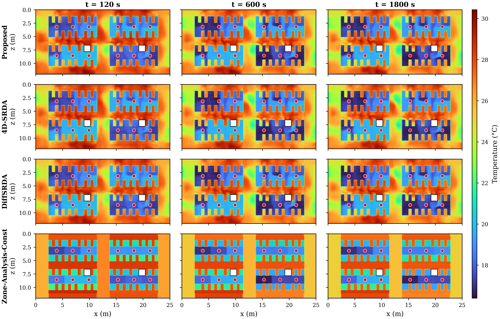

# Physics-Calibrated Residual Diffusion for Transient Thermal Field Reconstruction in Data Centers

Research code accompanying the manuscript by **Yueyue Guo and Lei Su**, Xinjiang University.

This project reconstructs high-resolution transient temperature fields a **coarse-fine scale hierarchical calibration framework**. A physics-based zonal dynamic model and ensemble Kalman filter (EnKF) track and calibrate regional thermal evolution. Conditioned on the assimilated zonal states, a latent residual diffusion model recovers unresolved fine-scale temperature structures.



*Figure 4 from the manuscript. Coarse-scale zonal calibration guides conditional residual generation and ensemble reconstruction.*

## Method

1. **Coarse-scale zonal thermal dynamics.** Represent each connected fluid zone by its volume-weighted mean temperature. Model its evolution using inter-zone heat transport, rack heat dissipation, cooling effects, and a temporal graph neural residual.
2. **Measurement-based calibration.** Assimilate sparse temperature observations in the zonal state space with EnKF. The resulting analysis ensemble provides physically interpretable regional thermal states and their uncertainty.
3. **Fine-scale residual diffusion.** Encode temperature residuals into a latent space and generate residual samples conditioned on analysis-member histories, state uncertainty, operating inputs, and observation innovations. Decode each sample and combine it with the corresponding zonal analysis member:

$$
\widehat{\mathbf{T}}_t^{(m)} = U\!\left(\mathbf{z}_t^{a,(m)}\right) + D_\phi\!\left(\widehat{\mathbf{h}}_t^{(m)}\right).
$$

Here, $U$ expands zonal states to the CFD grid and $D_\phi$ decodes the fine-scale residual. The ensemble mean is the final temperature-field estimate.

## Experimental setup

The study uses transient CFD simulations based on a real data center in Yiwu County, Hami City, Xinjiang, China. The CFD model is constructed in 6SigmaDCX using the facility layout and operating conditions.

| Property | Setting |
| --- | --- |
| Data hall dimensions | 25 m × 12 m × 5.4 m |
| Racks / CRAC units / temperature sensors | 70 / 46 / 12 |
| Fluid grid cells / connected zones | 1,438,769 / 40 |
| Trajectory duration / output interval | 1800 s / 30 s |
| Frames per trajectory | 61, including the initial state |
| Rack power | 25–40 kW |
| Supply-air temperature / fan operating ratio | 15–22 °C / 70%–100% |
| Training / validation / test split | 70% / 15% / 15%, by operating-condition trajectory |
| History length / latent dimension per zone | 4 / 32 |
| EnKF / reconstruction ensemble size | 64 / 64 |
| Diffusion training / DDIM sampling steps | 1000 / 50 |

All frames from an operating condition belong to the same subset. Normalization and assimilation error statistics are estimated from the training set. In the simulation experiments, observations are sampled from CFD cells at the sensor locations, and EnKF is initialized with the reference initial zonal temperatures.

## Results reported in the manuscript

The following values are reproduced from **Table 4** of the manuscript. Full-field RMSE evaluates all grid cells; top 5% hot-spot RMSE evaluates the hottest 5% of cells in the CFD reference at each time step. Lower values indicate better reconstruction accuracy.

| Method | Reconstruction target | Full-field RMSE (°C) | Top 5% hot-spot RMSE (°C) |
| --- | --- | ---: | ---: |
| Zone-Analysis-Const | Piecewise-constant zonal field | 1.754 ± 0.030 | 4.499 ± 0.086 |
| 4D-SRDA | Deterministic full-field representation | 0.392 ± 0.064 | 0.484 ± 0.101 |
| DiffSRDA | Full-field latent diffusion | 0.388 ± 0.066 | 0.472 ± 0.095 |
| **Proposed** | **Fine-scale residual latent diffusion** | **0.358 ± 0.062** | **0.367 ± 0.073** |

The manuscript reports a **7.73% reduction in full-field RMSE** and a **22.24% reduction in hot-spot RMSE** relative to DiffSRDA. On an NVIDIA A40, the reported total online computation time is **11.8152 s per update**, using 50-step DDIM sampling and 64 reconstruction members, within the considered 30 s update interval (Table 5).

### CFD reference fields



*Figure 7 from the manuscript. CFD reference temperature fields for the representative test sample at y = 3.1 m.*

### Reconstruction comparison



*Figure 8 from the manuscript. Rows show Proposed, 4D-SRDA, DiffSRDA, and Zone-Analysis-Const; columns show 120, 600, and 1800 s. Red circles indicate sensor locations and white regions indicate structural columns.*

The figures above are extracted directly from the manuscript. Results from a local run are written to `artifacts/evaluation/`.

## Installation

Use **Python 3.10+** and install the dependencies in your Python environment:

```bash
python -m pip install -r requirements.txt
```

The implementation uses PyTorch, NumPy, SciPy, Matplotlib, and PyYAML. For GPU execution, use a PyTorch build compatible with your CUDA environment and select `--device cuda:0`. CPU execution is available through `--device cpu`.

## Data preparation

Set the input paths in [`scripts/config.yaml`](scripts/config.yaml). Relative paths are resolved against `project.root_dir`, which is itself relative to the configuration file. The default `..` points to the repository root.

Expected input layout:

```text
data/raw/
├── samples/sample_XXXXXX.npz
├── dataset_300_parameters.csv
├── mesh.npz
├── zone3d_connected_v3_cells.npz
├── zone3d_connected_v3_config.json
├── zone3d_connected_v3_summary.json
├── real_cold_aisle_sensor_layout_12.csv
└── equipment_physical_layout_original.csv
```

Each sample NPZ contains `temperature_C` and `times_s`. Mesh geometry, zone assignments, equipment geometry, and sensor locations are validated during preparation. Raw CFD data and trained checkpoints are not bundled with this repository.

## Running the experiments

Run these commands from the repository root.

### Complete pipeline

```bash
python scripts/run_all.py --device cuda:0
```

This runs data preparation, zonal-model training and assimilation, full-field and residual autoencoders, three reconstruction models, test-set reconstruction, evaluation, spatial figures, and computational benchmarking.

### Evaluation with trained models

With model checkpoints and assimilation outputs available in the configured output directory:

```bash
python scripts/run_all.py --device cuda:0 --postprocess-only
```

### Spatial figures

```bash
python scripts/08_plot_paper_slice_layout_4x3.py --device cuda:0 --times 120 600 1800
```

This produces a one-row CFD reference figure and a four-row method comparison, with one column per time step. All panels share a temperature range. The default slice is `y = 3.1 ± 0.15 m`; irregular CFD cells are interpolated onto an x–z raster with obstacle masking. Both PNG and PDF are saved.

Use `--sample-id` to select a case. Without it, the plot uses the case selected by evaluation with the lowest Proposed trajectory-level full-field RMSE on the test set. Slice position, thickness, grid resolution, and color limits can be set using `--slice-height-m`, `--slice-half-thickness-m`, `--grid-nx`, `--grid-nz`, `--vmin`, and `--vmax`.

### Computational efficiency

```bash
python scripts/07_benchmark.py --device cuda:0 --all-frames
```

The benchmark measures zonal forecasting and EnKF updates, full-field reconstruction, total online latency, the ratio of latency to the 30 s update interval, and peak GPU memory when CUDA is used. Model loading, disk I/O, CFD-reference loading, and plotting are excluded. `--all-frames` measures all online frames; the default estimates trajectory runtime from representative frames.

### Run options

| Option for `run_all.py` | Purpose |
| --- | --- |
| `--config PATH` | Select a configuration file |
| `--resume` | Resume training from the saved best checkpoints |
| `--postprocess-only` | Run reconstruction, evaluation, figures, and benchmarking |
| `--skip-plots` | Skip spatial figures; evaluation curves are still generated |
| `--skip-benchmark` | Skip computational benchmarking |
| `--all-benchmark-frames` | Benchmark every online frame |
| `--smoke` | Use reduced settings for a small pipeline check |

For smoke runs, use a separate configuration with `project.output_dir: artifacts_smoke` to keep the outputs separate from the full experiment. Default plot times are restricted to the available smoke frames.

## Repository structure

| File or directory | Purpose |
| --- | --- |
| `scripts/config.yaml` | Data paths, model parameters, training and inference settings |
| `scripts/run_all.py` | Experiment orchestration |
| `scripts/00_prepare.py` | Data validation, geometry mapping, trajectory split and normalization |
| `scripts/01_zone_da.py` | Zonal dynamics, error statistics and EnKF assimilation |
| `scripts/02_autoencoder.py` | Full-field and residual autoencoders |
| `scripts/03_superresolution.py` | Deterministic and conditional diffusion model training |
| `scripts/04_reconstruct.py` | Test-set reconstruction and metric accumulation |
| `scripts/05_evaluate.py` | Error summaries, coverage diagnostics and rank histograms |
| `scripts/07_benchmark.py` | Online computational efficiency |
| `scripts/08_plot_paper_slice_layout_4x3.py` | CFD reference and method-comparison figures |
| `scripts/common.py` | Data utilities, geometry, model definitions and training infrastructure |
| `scripts/inference.py` | Shared model loading and ensemble reconstruction |
| `scripts/slice_utils.py` | Slice selection, interpolation, masking and panel rendering |
| `docs/assets/` | Manuscript figures displayed in this README |

## Evaluation outputs

Outputs are saved under `artifacts/evaluation/` by default:

| Output | Contents |
| --- | --- |
| `main_results.csv` | Full-field and hot-spot RMSE summary |
| `per_trajectory_metrics.csv` | Individual test-trajectory errors |
| `metrics_vs_time.csv` | Error evolution across time |
| `deterministic_rmse_vs_time.png / .pdf` | Temporal error curves with between-trajectory standard deviations |
| `uncertainty_coverage.csv` | Volume-weighted empirical coverage at 50%, 80% and 90% nominal levels |
| `coverage_reliability.png / .pdf` | Coverage reliability plot |
| `rank_histogram.csv`, `rank_histograms.png / .pdf` | Volume-weighted ensemble rank diagnostics |
| `computational_efficiency.csv / .json` | Latency, time ratio, trajectory runtime and GPU memory |
| `paper_slice_layout/sample_XXXXXX/` | `paper_truth_evolution` and `paper_reconstruction_comparison`, in PNG and PDF |

Reconstruction metrics are computed from 30 to 1800 s, excluding the initial state. Deterministic RMSE uses equal cell weights, while coverage and rank frequencies use cell volumes. Checkpoints and intermediate outputs are stored in the configured `artifacts` directory and excluded from Git by `.gitignore`.

## Reference

Yueyue Guo and Lei Su. *Physics-Calibrated Residual Diffusion for Transient Thermal Field Reconstruction in Data Centers*. Manuscript.
